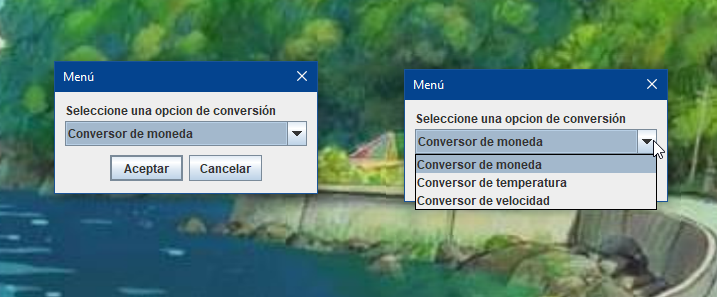
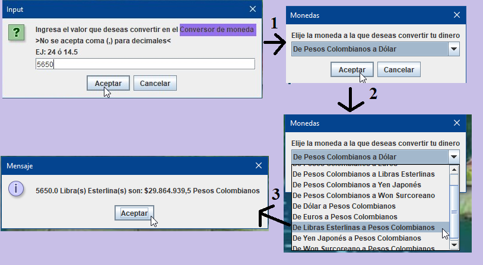
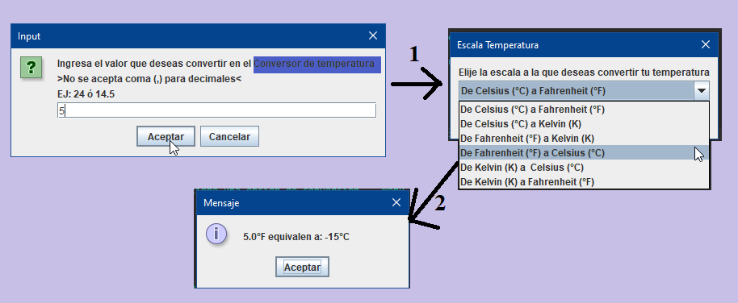
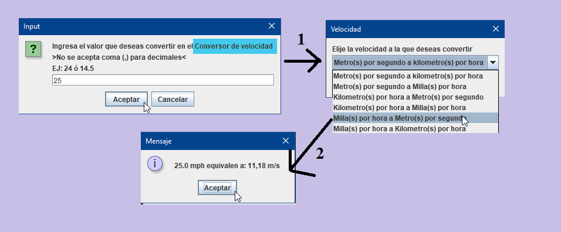
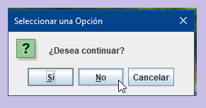
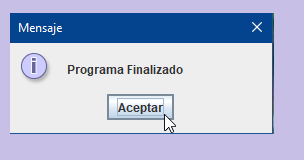

# Conversor 💱 🌡️ 🚅

_El Conversor es un programa que te permite realizar conversiones de moneda, temperatura y velocidad.
Puedes seleccionar la opción de conversión y proporcionar el valor que deseas convertir para obtener
el resultado en la unidad deseada._

### Pre-requisitos 📋

* JDK (Java Development Kit) instalado en el sistema.
* Eclipse IDE (Integrated Development Environment) instalado en el sistema _(opcional)_.

## Construido con 🛠️

_Menciona las herramientas que utilizaste para crear tu proyecto_

* [JAVA ☕](https://docs.oracle.com/en/java/) - El lenguaje de programación utilizado.
* [Eclipse](https://www.eclipse.org/) - El entorno de desarrollo integrado utilizado.

## Ejecución 🔧

### Ejecución en la Terminal

1. Compila el archivo Java usando el siguiente comando:
```
javac Conversor.java
```
2. Después de compilar, ejecuta el programa con el siguiente comando:
```
java Conversor
```
3. Sigue las instrucciones proporcionadas en la interfaz de línea de comandos para realizar las conversiones deseadas.

### Ejecución en Eclipse IDE

1. Clona el repositorio o descarga el archivo `ConversorMoneda.java` en tu máquina.
2. Abre Eclipse IDE.
3. Haz clic en `"File" (Archivo)` en la barra de menú y selecciona `"Open Projects from File System"`.
4. Haz clic en `"Directory" (Directorio)` y selecciona la ubicación donde clonaste o descargaste el repositorio.
5. Haz clic en `"Finish" (Finalizar)` para importar el proyecto a `Eclipse`.
6. Una vez que el proyecto esté importado, busca el archivo `ConversorMoneda.java` en el árbol de directorios del proyecto.

_NOTA: Recuerda que debes tener instalado Java Development Kit (JDK) en tu sistema y haber configurado correctamente las variables de entorno 
para que los comandos de compilación y ejecución funcionen adecuadamente._

## Uso ▶️

1. Cuando ejecutes el programa, se abrirá una ventana emergente que muestra un menú con opciones de conversión: _Conversor de moneda_ 💸, _Conversor de temperatura 🌡️_,
_Conversor de velocidad 🚅_
3. Dependiendo el conversor que elijas, se mostrará un cuadro de dialogo donde puedes ingresar el valor que deseas convertir.
_Asegúrate de ingresar solo números y utiliza el punto `(.)` para representar los decimales (por ejemplo, 24 o 14.5)._
4. Luego de ingresar el valor, se mostrará otro cuadro de diálogo para elegir la escala de conversión.
5. Dependiendo de la opción seleccionada, se realizará la conversión y se mostrará el resultado en otro cuadro de dialogo.
6. Después de mostrar el resultado de la conversión, se te preguntará si deseas continuar con otra conversión.
7. Si seleccionas `Sí`, el programa reiniciará el proceso y podrás realizar otra conversión. Si seleccionas `No` o `Cancelar` el programa finalizará.

_Recuerda que debes seguir las instrucciones y asegurarte de ingresar los valores correctamente para obtener resultados precisos._

## Vista previa 🔍

### Menú Conversor

}

### Conversor Moneda 💱 



### Conversor Temperatura 🌡️ 



### Conversor Velocidad 🚅



### ¿Desea Continuar? / Finalizado

  

## Contribución 🖇️

Actualmente no se aceptan contribuciones para este proyecto.

## Autores ✒️

* **Yuly A. Beltran** - _Autor principal_ - [Yuanbru](https://github.com/yuanbru) 🧩

## Licencia 📄

Este proyecto está bajo la Licencia MIT - mira el archivo [LICENSE.md](LICENSE.md) para detalles

## Expresiones de Gratitud 🎁

* Comenta a otros sobre este proyecto 📢
* Sigueme en Github [Yuanbru](https://github.com/yuanbru) 🧩
* Conecta en Linkedin [Yuly A Beltran](https://www.linkedin.com/in/yulyab2105/) 💼


---
 👩🏽‍💻 con ❤️ por [Yuanbru](https://github.com/yuanbru) 🧩
